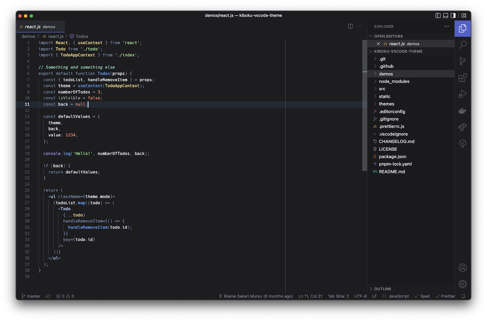

# Kiboku color theme for Visual Studio Code

A dark theme with focus on higlighting semantic syntax for [VS Code](https://code.visualstudio.com/).

> This theme is under development. Feedback and contributions are appreciated and welcomed!

Works best with semantic token colors enabled!



## Install

1. Go to [VS Code Marketplace](https://marketplace.visualstudio.com/items?itemName=mskri.kiboku-vscode-theme)
2. Click on the "Install" button

## Recommended VS Code settings

Enable semantic token colors by adding following to your `settings.json`

```json
"editor.semanticTokenColorCustomizations": {
  "enabled": true
},
```

## Contribute

1. Clone repository
2. Open the repository in Visual Studio Code
3. Start Extension Development Host window by pressing `F5`
4. Open `Code > Preferences > Color Theme` and pick "Kiboku"
5. Run `npm install` to install development depedencies
6. Run `npm start` to automatically run the theme builder when files in `src/` change
7. Make changes to the theme
8. Commit your changes and open a PR

### Help for working with theming

- [VS Code theme color API reference](https://code.visualstudio.com/api/references/theme-color)
- Examine syntax scopes by invoking the [`Developer: Inspect Editor Tokens and Scopes`](https://code.visualstudio.com/api/language-extensions/syntax-highlight-guide#scope-inspector) command from the Command Palette (`ctrl + shift + p` / `cmd + shift + p`) in the Extension Development Host window

### Available also for these applications

- iTerm 2: [kiboku-iterm](https://github.com/mskri/kiboku-iterm)
